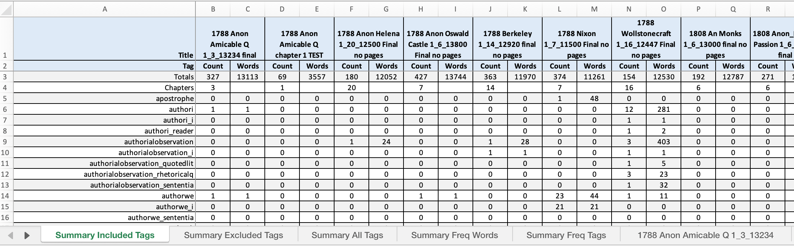
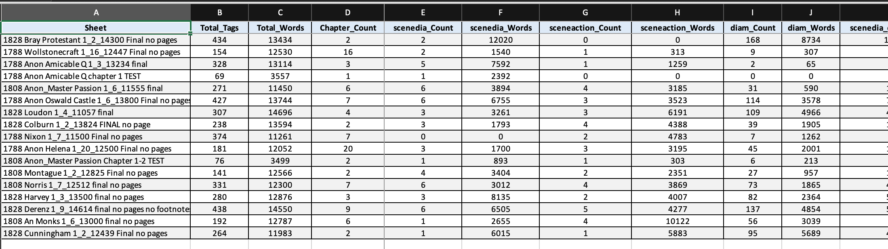
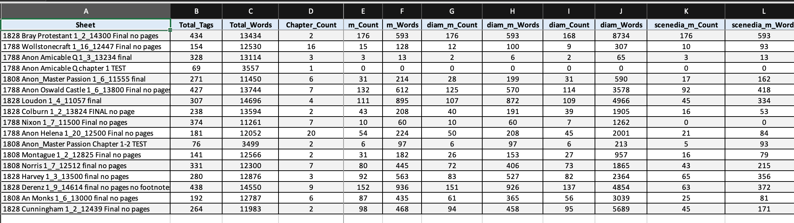
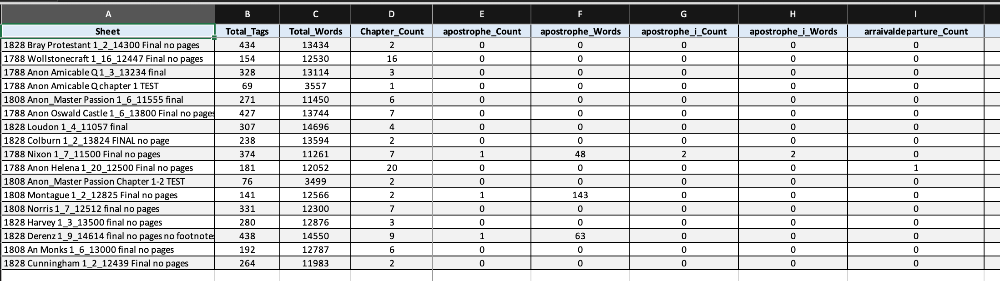

# Novel Scene Analysis Project

[](https://gitpod.io/#https://github.com/aculich/novel-scenification)

This repository contains tools for analyzing scenes and tags in literary texts, particularly focusing on the evolution of scenic techniques in English novels from 1788-1828.

This repository supports the following paper, currently in preprint form being prepared for publication:

> # Scenification of the Novel in the Time of Jane Austen
>
> Authors: Nicholas Paige^1,*; Aaron Culich^2
>
> - ^1 University of California, Department of French, Berkeley CA 94530-2580 USA  
> - ^2 University of California, Eviction Research Network, Berkeley CA 94530 USA
>
> ## Abstract
>
> This paper presents a study of the evolving use of scenes in the English novel circa 1800. The distinction between summary and scene has been a basic one in classical narratology, but comparatively little research exists on the historical development of scenic narrative techniques. Although quantitative methods have identified growth in textual features that may be expected to be linked to changes in scenic narration, the typical bag-of-words approach has limited understanding of how techniques perceptible to human readers may change over time. Our approach uses a hierarchical tagging schema to annotate scene types and their internal components to assist in quantifying scenic architecture. The project described uses BeautifulSoup4 and custom Python scripts and future analysis will integrate computational tools such as BookNLP with custom scene annotations in order to understand the evolution of narrative techniques.
>
> ## Keywords
>
> Narratology, novel, fiction, scene, summary

## Tag Schema

The hierarchical tagging schema is comprised of primary scene category tags and nested component tags. Then we process the tagged text using BeautifulSoup4 and custom Python scripts (`count_tags.py` available in our github repository) to quantify:
   - Frequency and word count of each scene type
   - Hierarchical relationships between primary and component tags

The HTML files are tagged with a custom schema that identifies different scene types:

### Primary Scene Tags
- `<SceneDia>`: Dialogue-dominant scenes where character speech drives narrative progression
- `<SceneAction>`: Action-focused scenes depicting physical events or movements
- `<SceneQuasi>`: Transitional scenes blending scenic and summary elements
- `<ScenePerception>`: Scenes focused on character perception and sensory experience

### Component Tags
Within each scene type, we track:
- `<Dia>, <DiaM>, <DiaQ>`: Direct dialogue with varying attributions
- `<Trigger>`: Temporal or spatial anchors that signal scene transitions
- `<M>`: Markers denoting speech attribution or narrative framing
- `<FID>`: Free indirect discourse elements

## Data & Code Overview

The project analyzes manually tagged HTML files to track the development of scenic techniques in novels. It processes these files to count tags, calculate word counts within different scene types, and analyze hierarchical relationships between tags.

### Contents

- `count_tags.py`: The main script for processing tagged HTML files
- `data/input/`: Directory containing HTML files with manual tagging
- `data/counts/`: Directory where CSV output files are stored
- [`data/tag_counts_summary.xlsx`](https://github.com/aculich/novel-scenification/raw/refs/heads/main/data/tag_counts_summary.xlsx): Excel summary file of all tag counts and analysis (direct download link)

## GitHub Actions Workflow

This project uses GitHub Actions to automate the tag analysis process. The workflow automatically processes HTML files, generates counts, and updates summary files whenever changes are made to input files.

### Automatic Triggering

The workflow is automatically triggered when:
- Any file in the `data/input/` directory is added, modified, or deleted
- The workflow is manually triggered (see below)

When triggered, the workflow:
1. Sets up a Python environment
2. Installs required dependencies
3. Runs the `count_tags.py` script
4. Commits and pushes any changes to output files

### Running the Workflow Manually

You can manually trigger the workflow if you need to regenerate all outputs without changing input files:

1. Navigate to the repository on GitHub: [novel-scenification](https://github.com/aculich/novel-scenification)
2. Click on the "Actions" tab at the top of the repository
3. In the left sidebar, click on "Auto Tag Analysis"
4. Click the "Run workflow" button (dropdown on the right side)
5. Select the branch (usually "main")
6. Click the green "Run workflow" button to start the process


The workflow will then execute and you can monitor its progress:
- A yellow circle indicates the workflow is in progress
- A green checkmark indicates successful completion
- A red X indicates a failure

### Troubleshooting Workflow Issues

If the workflow fails, you can diagnose the issue by:

1. On the Actions tab, click on the failed workflow run
2. Examine the error message in the summary
3. Click on the failed job to see detailed logs
4. Expand the step that failed to see specific error messages

Common issues include:
- Python dependencies not installing correctly
- Problems with input file formatting
- Permissions issues when trying to commit changes

### Filing Issues

If you encounter persistent problems with the workflow or other aspects of the project:

1. Navigate to the [Issues page](https://github.com/aculich/novel-scenification/issues)
2. Click the green "New issue" button
3. Provide a descriptive title and detailed description
4. Include:
   - What you were trying to do
   - The specific error messages you received
   - Screenshots of the error if available
   - Steps to reproduce the issue
5. Click "Submit new issue"

When submitting issues, please include as much context as possible to help with troubleshooting. Screenshots of error messages are particularly helpful.

## Interactive Analysis with Jupyter Notebook

To facilitate interactive analysis and visualization of tag data, this project includes `notebook.ipynb`, a comprehensive Jupyter notebook that provides:

### Key Features of the Notebook:

1. **Data Processing & Analysis**
   - One-click execution of `count_tags.py` to process all input files
   - Summary views of tag analysis results
   - Detailed data visualization with charts showing tag distribution and word counts

2. **Data Exploration**
   - Interactive visualizations of word counts, scene types, and temporal trends
   - Analysis of scene type percentages across different texts
   - Tools to explore tag frequency data and patterns

3. **Individual Text Analysis**
   - Dedicated functions to analyze tag patterns in specific texts
   - Visualization of tag distributions within individual works
   - Comparison of tag usage across the corpus

4. **Compound Tag Analysis**
   - Tools for examining nested tag combinations across all texts
   - Visualization of complex tag relationships
   - Analysis of hierarchical tag structures

### Using the Notebook:

The easiest way to use the notebook is to launch the project in GitPod using the button above. This will:
1. Set up a cloud environment with all dependencies installed
2. Install the required Python kernel ("Python (Novel Scenification)")
3. Allow you to process files and explore results interactively

If you've added new files to `data/input/`, you can:
1. Run the tag analysis in the notebook
2. Explore the updated results with visualizations
3. Commit your changes back to GitHub

Alternatively, GitHub Actions will automatically process new input files when they are pushed to the repository.

### Excel Summary Format

The `tag_counts_summary.xlsx` file contains a comprehensive analysis of tags used across your HTML corpus. We've organized it with four summary tabs:

#### 1. Summary Tab
This is the original summary tab that provides a concise overview:
- **Sheet column**: Links to individual sheets for each document
- **Total_Tags**: Total number of tags in the document
- **Total_Words**: Total word count for the entire document
- **Chapter_Count**: Number of chapter markers
- **Selected tag metrics**: Pre-selected important tags (SceneAction, SceneDia, Dialogue) with both count and word columns

This tab answers: "What are the basic metrics for each document?"



#### 1a. Summary Included Tags Tab
This tab displays only the tags that are included in the [included_tags.tsv](./included_tags.tsv) file:
- Follows the same format as the Summary tab but limited to the specified included tags
- Shows counts and word counts for each included tag across all documents
- Useful for focusing on a specific subset of tags that are most relevant to your analysis

This tab answers: "How do my specifically selected tags distribute across documents?"

#### 1b. Summary Excluded Tags Tab
This tab displays only the tags that are excluded (listed in [excluded_tags.tsv](./excluded_tags.tsv)):
- Follows the same format as the Summary tab but limited to tags not in the included tags list
- Shows counts and word counts for excluded tags across all documents
- Useful for reviewing tags that might be less relevant or for quality control

This tab answers: "What tags am I currently not focusing on in my analysis?"

#### 2. Summary Freq Words Tab
This tab shows all tags sorted by their total word count across the corpus:
- Tags that contain the most words appear leftmost
- Secondary sorting is by tag count when word counts are equal
- Each column pair shows Count and Words for each tag

This tab answers: "Which tags contain the most textual content?"



#### 3. Summary Freq Tags Tab
This tab arranges tags by their frequency (count) across the corpus:
- The most frequently used tags appear leftmost
- Secondary sorting is by word count when tag counts are equal
- Each column pair shows Count and Words for each tag

This tab answers: "Which tags are used most frequently?"



#### 4. Summary All Tags Tab
This tab shows all tags in alphabetical order:
- Provides a consistent reference layout regardless of frequency
- Each column pair shows Count and Words for each tag

This tab answers: "What are all the tags used and their metrics?"



#### Individual Document Sheets
Following the summary tabs, each document has its own sheet showing:
- Individual tag metrics including compound/nested tags
- Full breakdown of all tags used in that specific document
- Word counts for each tag and tag combination

### Requirements

Required Python packages:
```
beautifulsoup4>=4.9.3
pandas>=1.3.0
openpyxl>=3.0.7
```

### Usage

1. Install the required dependencies:
   ```
   pip install -r requirements.txt
   ```

2. Run the tag counting script:
   ```
   python count_tags.py
   ```

3. The script will:
   - Process all HTML files in `data/input/`
   - Generate CSV files with tag counts in `data/counts/`
   - Create a summary Excel file at `data/tag_counts_summary.xlsx`
   - Generate `included_tags.tsv` and `excluded_tags.tsv` based on tags in `tag_matches_detailed.tsv`

### Customizing Included/Excluded Tags

To modify which tags are included or excluded in the "Summary Included Tags" and "Summary Excluded Tags" tabs:

1. The script uses `tag_matches_detailed.tsv` to determine which tags to include. This file is generated using the `match_tags.py` script based on patterns in `keep_for_summary_tags.tsv`.

2. To customize the included tags:
   - Edit `keep_for_summary_tags.tsv` to add or remove tag patterns
   - Run `python match_tags.py` to generate an updated `tag_matches_detailed.tsv`
   - Run `python count_tags.py` to regenerate the Excel file with the new tag selection

3. You can also manually edit `tag_matches_detailed.tsv` to add or remove specific tags if you prefer direct control over the exact tags included.

## Tag Counts Summary

[View complete tag counts summary](https://github.com/aculich/novel-scenification/raw/refs/heads/main/data/tag_counts_summary.xlsx)

| Sheet | Total_Tags | Total_Words | Chapter_Count | SceneAction_Count | SceneAction_Words | SceneDia_Count | SceneDia_Words | Dialogue_Count | Dialogue_Words |
|-------|------------|-------------|---------------|------------------|------------------|----------------|----------------|----------------|----------------|
| [1808 An Monks 1_6_13000 final no pages](https://github.com/aculich/novel-scenification/blob/main/data/input/1808%20An%20Monks%201_6_13000%20final%20no%20pages.html) | 192 | 12787 | 6 | 4 | 10122 | 1 | 2655 | 2 | 59 |
| [1788 Anon Amicable Q 1_3_13234 final](https://github.com/aculich/novel-scenification/blob/main/data/input/1788%20Anon%20Amicable%20Q%201_3_13234%20final.html) | 327 | 13113 | 3 | 1 | 1259 | 5 | 7592 | 65 | 3630 |
| [1808 Montague 1_2_12825 Final no pages](https://github.com/aculich/novel-scenification/blob/main/data/input/1808%20Montague%201_2_12825%20Final%20no%20pages.html) | 141 | 12566 | 2 | 2 | 2351 | 4 | 3404 | 3 | 126 |
| [1788 Wollstonecraft 1_16_12447 Final no pages](https://github.com/aculich/novel-scenification/blob/main/data/input/1788%20Wollstonecraft%201_16_12447%20Final%20no%20pages.html) | 154 | 12530 | 16 | 1 | 313 | 2 | 1540 | 3 | 57 |
| [1828 Derenz 1_9_14614 final no pages no footnotes](https://github.com/aculich/novel-scenification/blob/main/data/input/1828%20Derenz%201_9_14614%20final%20no%20pages%20no%20footnotes.html) | 438 | 14550 | 9 | 5 | 4277 | 6 | 6505 | 25 | 990 |
| [1828 Cunningham 1_2_12439 Final no pages](https://github.com/aculich/novel-scenification/blob/main/data/input/1828%20Cunningham%201_2_12439%20Final%20no%20pages.html) | 264 | 11983 | 2 | 1 | 5883 | 1 | 6015 | 2 | 172 |
| [1788 Berkeley 1_14_12920 final no pages](https://github.com/aculich/novel-scenification/blob/main/data/input/1788%20Berkeley%201_14_12920%20final%20no%20pages.html) | 363 | 11970 | 14 | 1 | 566 | 0 | 0 | 1 | 49 |
| [1828 Harvey 1_3_13500 final no pages](https://github.com/aculich/novel-scenification/blob/main/data/input/1828%20Harvey%201_3_13500%20final%20no%20pages.html) | 280 | 12876 | 3 | 2 | 4007 | 3 | 8135 | 12 | 550 |
| [1788 Anon Helena 1_20_12500 Final no pages](https://github.com/aculich/novel-scenification/blob/main/data/input/1788%20Anon%20Helena%201_20_12500%20Final%20no%20pages.html) | 180 | 12052 | 20 | 3 | 3195 | 3 | 1700 | 1 | 11 |
| [1808 Anon_Master Passion Chapter 1-2 TEST](https://github.com/aculich/novel-scenification/blob/main/data/input/1808%20Anon_Master%20Passion%20Chapter%201-2%20TEST.html) | 76 | 3499 | 2 | 1 | 303 | 1 | 893 | 22 | 388 |
| [1828 Loudon 1_4_11057 final](https://github.com/aculich/novel-scenification/blob/main/data/input/1828%20Loudon%201_4_11057%20final.html) | 307 | 14696 | 4 | 3 | 6191 | 3 | 3261 | 28 | 1187 |
| [1788 Nixon 1_7_11500 Final no pages](https://github.com/aculich/novel-scenification/blob/main/data/input/1788%20Nixon%201_7_11500%20Final%20no%20pages.html) | 374 | 11261 | 7 | 2 | 4783 | 0 | 0 | 1 | 16 |
| [1808 Norris 1_7_12512 final no pages](https://github.com/aculich/novel-scenification/blob/main/data/input/1808%20Norris%201_7_12512%20final%20no%20pages.html) | 331 | 12300 | 7 | 4 | 3869 | 6 | 3012 | 51 | 1087 |
| [1828 Colburn 1_2_13824 FINAL no page](https://github.com/aculich/novel-scenification/blob/main/data/input/1828%20Colburn%201_2_13824%20FINAL%20no%20page.html) | 238 | 13594 | 2 | 4 | 4388 | 3 | 1793 | 12 | 537 |
| [1808 Anon_Master Passion 1_6_11555 final](https://github.com/aculich/novel-scenification/blob/main/data/input/1808%20Anon_Master%20Passion%201_6_11555%20final.html) | 271 | 11450 | 6 | 4 | 3185 | 6 | 3894 | 79 | 2430 |
| [1788 Anon Amicable Q chapter 1 TEST](https://github.com/aculich/novel-scenification/blob/main/data/input/1788%20Anon%20Amicable%20Q%20chapter%201%20TEST.html) | 69 | 3557 | 1 | 0 | 0 | 1 | 2392 | 29 | 1893 |
| [1828 Bray Protestant 1_2_14300 Final no pages](https://github.com/aculich/novel-scenification/blob/main/data/input/1828%20Bray%20Protestant%201_2_14300%20Final%20no%20pages.html) | 434 | 13434 | 2 | 0 | 0 | 2 | 12020 | 1 | 95 |
| [1788 Anon Oswald Castle 1_6_13800 Final no pages](https://github.com/aculich/novel-scenification/blob/main/data/input/1788%20Anon%20Oswald%20Castle%201_6_13800%20Final%20no%20pages.html) | 427 | 13744 | 7 | 3 | 3523 | 6 | 6755 | 25 | 433 |


## Scene Samples

[View complete samples analysis](data/SAMPLES.md)

# Scene Samples

This document contains particularly rich examples of scene markup from each text, showing complex interactions between different types of scenes and their components. For each scene, we show interesting excerpts including openings, transitions, rich dialog sections, and endings.

## [1788 Nixon 1_7_11500 Final no pages.html](https://github.com/aculich/novel-scenification/blob/main/data/input/1788%20Nixon%201_7_11500%20Final%20no%20pages.html)

### Complex Sceneaction (Lines 71-95)

**Location:** [Lines 71-95](https://github.com/aculich/novel-scenification/blob/main/data/input/1788%20Nixon%201_7_11500%20Final%20no%20pages.html#L71-L95)

**Complexity Metrics:**
- Unique tag types: 8
- Total nested tags: 80
- Word count: 2592
- Tag types present: authorwe, diam, diaq, i, m, monologuethought, reader, trigger

**Interesting Excerpts:**

*Scene Transition:* [Lines 105-124](https://github.com/aculich/novel-scenification/blob/main/data/input/1788%20Nixon%201_7_11500%20Final%20no%20pages.html#L105-L124)
```html
<sceneaction>They proceeded for a tedious length of time in a course of the most perplexing uncertainties -— one while thinking themselves perfectly right, and the next minute quite as confident they were utterly wrong, and that they had made no progress at all towards the inn. -— Woods, dingles, cross-paths, hills, and dales, continually offering themselves for their choice, they did not know what to do with such a numberless variety of difficulties, which frequently interrupted their view of the great mountains, their original guide, but were obliged to puzzle on at haphazard <trigger>until</trigger>, after much fatigue, turning and twisting, great loss of time and ground, the wavering vixen, <i>Fortune</i>, dropped upon them of a sudden, and when they were at their utmost need, in the likeness of a BUTTERWOMAN.

This their deliverer from perplexity and confusion, was coming down a narrow lane within thirty yards of the very road they had lost, and was driving an <i>ass</i> before her, with panniers upon its back stuffed with butter, eggs, and other small wares, that she was conveying to a market, for the morrow, ten miles, she said, beyond the Inn they were going to. They would, in all probability, have crossed the road they wanted to find, from <i>Sturdy</i>'s imperfect knowledge of it, and from their falling in with it at the time both him and his master were impressed with a strong conviction they were by no means near it, had it not been for the <i>butterwoman</i>. So much, indeed, had <i>Sturdy</i>'s mind been all along distressed at his losing the road at all, that at first he could hardly believe their information; -— however, after going into it, and looking about him, and recollecting himself a little, he discovered sufficient tokens to satisfy him and his matter that their intelligence was good. They were, therefore, exceedingly pleased with the <i>butterwoman</i>, and as they had not eaten or drank during the course of so long and tiresome a walk, the <i>butterwoman</i> and her <i>ass</i> were invited to a repast with them under a hedge, which Thomas produced out of his wallet for his master, himself, and the <i>butterwoman</i>, and providence did the same for the <i>ass</i>, in a plentiful bank of thistles by their side; while a nice spring of clear water dropped down a little precipice, ready to dilute, in a tin can, some chearful and reviving spirits which <i>Thomas</...
```

*Scene Opening:* [Lines 105-124](https://github.com/aculich/novel-scenification/blob/main/data/input/1788%20Nixon%201_7_11500%20Final%20no%20pages.html#L105-L124)
```html
<sceneaction>They proceeded for a tedious length of time in a course of the most perplexing uncertainties -— one while thinking themselves perfectly right, and the next minute quite as confident they were utterly wrong, and that they had made no progress at all towards the inn. -— Woods, dingles, cross-paths, hills, and dales, continually offering themselves for their choice, they did not know what to do with such a numberless variety of difficulties, which frequently interrupted their view of the great mountains, their original guide, but were obliged to puzzle on at haphazard <trigger>until</trigger>
```

*Scene Ending:* [Lines 105-124](https://github.com/aculich/novel-scenification/blob/main/data/input/1788%20Nixon%201_7_11500%20Final%20no%20pages.html#L105-L124)
```html
<sceneaction>They proceeded for a tedious length of time in a course of the most perplexing uncertainties -— one while thinking themselves perfectly right, and the next minute quite as confident they were utterly wrong, and that they had made no progress at all towards the inn. -— Woods, dingles, cross-paths, hills, and dales, continually offering themselves for their choice, they did not know what to do with such a numberless variety of difficulties, which frequently interrupted their view of the great mountains, their original guide, but were obliged to puzzle on at haphazard <trigger>until</trigger>, after much fatigue, turning and twisting, great loss of time and ground, the wavering vixen, <i>Fortune</i>, dropped upon them of a sudden, and when they were at their utmost need, in the likeness of a BUTTERWOMAN.

This their deliverer from perplexity and confusion, was coming down a narrow lane within thirty yards of the very road they had lost, and was driving an <i>ass</i> before her, with panniers upon its back stuffed with butter, eggs, and other small wares, that she was conveying to a market, for the morrow, ten miles, she said, beyond the Inn they were going to. They would, in all probability, have crossed the road they wanted to find, from <i>Sturdy</i>'s imperfect knowledge of it, and from their falling in with it at the time both him and his master were impressed with a strong conviction they were by no means near it, had it not been for the <i>butterwoman</i>. So much, indeed, had <i>Sturdy</i>'s mind been all along distressed at his losing the road at all, that at first he could hardly believe their information; -— however, after going into it, and looking about him, and recollecting himself a little, he discovered sufficient tokens to satisfy him and his matter that their intelligence was good. They were, therefore, exceedingly pleased with the <i>butterwoman</i>, and as they had not eaten or drank during the course of so long and tiresome a walk, the <i>butterwoman</i> and her <i>ass</i> were invited to a repast with them under a hedge, which Thomas produced out of his wallet for his master, himself, and the <i>butterwoman</i>, and providence did the same for the <i>ass</i>, in a plentiful bank of thistles by their side; while a nice spring of clear water dropped down a little precipice, ready to dilute, in a tin can, some chearful and reviving spirits which <i>Thomas</...
```

## [1808 Anon_Master Passion Chapter 1-2 TEST.html](https://github.com/aculich/novel-scenification/blob/main/data/input/1808%20Anon_Master%20Passion%20Chapter%201-2%20TEST.html)

### Complex Sceneaction (Lines 37-47)

**Location:** [Lines 37-47](https://github.com/aculich/novel-scenification/blob/main/data/input/1808%20Anon_Master%20Passion%20Chapter%201-2%20TEST.html#L37-L47)

**Complexity Metrics:**
- Unique tag types: 7
- Total nested tags: 10
- Word count: 303
- Tag types present: dia, diam, diaq, fidquotes, i, m, trigger

**Interesting Excerpts:**

*Scene Opening:* [Lines 37-47](https://github.com/aculich/novel-scenification/blob/main/data/input/1808%20Anon_Master%20Passion%20Chapter%201-2%20TEST.html#L37-L47)
```html
<sceneaction><diam>"O yes you will, Sir;" <m>said she, <trigger>one day</trigger>
```

*Scene Ending:* [Lines 37-47](https://github.com/aculich/novel-scenification/blob/main/data/input/1808%20Anon_Master%20Passion%20Chapter%201-2%20TEST.html#L37-L47)
```html
<sceneaction><diam>"O yes you will, Sir;" <m>said she, <trigger>one day</trigger></m>, "and, besides, I know you and Frederick will take care of me: — as for him, if poney does but trip the least in the world, he is always ten times more frightened than I am.”</diam>
<dia>"But what could I, or even <i>Frederick</i> do, should Frolick run away with you ? He is but a foolish Frolick, and if we were to pursue him, would only scamper away the faster; and if you should fall off, and break your little neck, what would become of poor mamma ?”</dia>
<dia>"O my pretty mamma! — well, now I will be very good indeed, if you will but put the bridle right once more.”</dia>

Frederick was <fidquotes>"sure <i>he</i> could do that;"</fidquotes> —but before he had time to take hold of it, Frolick, with a sudden nod, had twitched it out of her hand. It fell, and entangled his foot, which both incommoded and alarmed him, and he began to wheel about, still treading on the bridle, and appearing to be every moment ready to fall, with his trembling little rider, to the ground; but Frederick, who in an instant had dismounted, seized his foot, and while Mr. Melcombe took charge of Helena, disentangled the bridle, and set poney on his legs again; — but, colouring with terror at what might have happened, cried out —

<diaq>"Helena, Helena, why did you let it go ?”</diaq> — She mounted again with great composure, saying,

<diaq>"So! now you are going to scold!”</diaq> At last, all was adjusted, and they rode peaceably on to Mrs. Villiers’s house, where she was anxiously watching for them at the parlour window. Mr. Melcombe took Helena from her steed with the greatest care, gave her an affectionate kiss, and away she ran to her mamma.</sceneaction>
```

### Complex Scenedia (Lines 51-124)

**Location:** [Lines 51-124](https://github.com/aculich/novel-scenification/blob/main/data/input/1808%20Anon_Master%20Passion%20Chapter%201-2%20TEST.html#L51-L124)

**Complexity Metrics:**
- Unique tag types: 11
- Total nested tags: 46
- Word count: 893
- Tag types present: chnonameintro, descriptor, dia, diam, diaq, fidquotes, i, italicsother, m, quotedlit, trigger

**Interesting Excerpts:**

*Scene Transition:* [Lines 51-70](https://github.com/aculich/novel-scenification/blob/main/data/input/1808%20Anon_Master%20Passion%20Chapter%201-2%20TEST.html#L51-L70)
```html
<scenedia>On the following morning, Mrs. Villiers, having spent some hours in the instruction of Helena, dismissed her to her amusements in the garden: and Helena, <trigger>perceiving</trigger> an <chnonameintro>old man</chnonameintro> who was frequently employed to work in it, and with whom she had formed the <i>strictest friendship</i>, was presently at his side. She would often stand near him, watching him at his occupation, and asking him a hundred pretty questions, which he was ever ready to answer, and sometimes would she busily employ herself, under his directions, and delight in fancying that she was of prodigious use to him in his labours. She had been thus engaged for about an hour, while Mrs. Villiers had been sitting at her work. Helena entered —

<diaq>"Pray, mamma, what sort of a place is London ?”</diaq>
<dia>"A large question, Helena: perhaps you may see one day or other; but what put London in your head just now ?”</dia>
<dia>"Why, mamma, old Bernard says it’s the D—l’s Country — naughty word you know! — he says he saw him there, and told me a great deal about it; it’s a very pretty story, mamma; do, let him tell it you himself.”</dia>
<dia>"Old Bernard talks nonsense; — but my dear child, how you have heated yourself! what have you been about ?”</dia>
<dia>"Hard at work, mamma, helping old Bernard.”</dia>
<dia>"Well, now, go and take off your bonnet, and then come and help me; — for I am tired of this hearth-rug, and want it finished.”</dia>

Away she flew, but <italicsother><i>flew</i></italicsother> not back. Mrs. Villiers began to wonder what was become of her. At last she appeared.

<dia>"What have you been doing all this time, Helena ?”</dia>
<dia>"Curling my hair nice, mamma. Old Bernard said it was very pretty; so, I was looking at it in the glass, and I quite forgot you were waiting for me.”</dia>
<dia>"What should old Bernard know about hair, child ? do sit down, and shade that flower as I have done this.”</dia>
<dia>"Yes, mamma.”</dia>

At that moment entered Frederick, with his arm full of new books.

<dia>"O mamma, look at Frederick!”</dia> — He approached, and, with whimsical gravity, dropped on one knee to Helena, and, tottering, presented the books,

<diaq>"With Mr. Melcombe’s duty to Miss Villiers.”</diaq>
<diam>"How kind is Mr. Melcombe!” <m>said Mrs. Villiers.</m></diam>
<dia>"Mr. Melcombe’s <i>duty</i> to <i>me</i>, mamma!”</dia> <descriptor>— and she laughed, and chuckled, for a minute</descriptor>; and then, with assumed dignity, befitting the occasion, prepared to receive them graciously: when Frederick, having lost his gravity, — and his balance, tumbled them all on the floor. Not being in a sedate mood, he made anothe...
```

*Scene Opening:* [Lines 51-70](https://github.com/aculich/novel-scenification/blob/main/data/input/1808%20Anon_Master%20Passion%20Chapter%201-2%20TEST.html#L51-L70)
```html
<scenedia>On the following morning, Mrs. Villiers, having spent some hours in the instruction of Helena, dismissed her to her amusements in the garden: and Helena, <trigger>perceiving</trigger>
```

*Scene Ending:* [Lines 51-70](https://github.com/aculich/novel-scenification/blob/main/data/input/1808%20Anon_Master%20Passion%20Chapter%201-2%20TEST.html#L51-L70)
```html
<scenedia>On the following morning, Mrs. Villiers, having spent some hours in the instruction of Helena, dismissed her to her amusements in the garden: and Helena, <trigger>perceiving</trigger> an <chnonameintro>old man</chnonameintro> who was frequently employed to work in it, and with whom she had formed the <i>strictest friendship</i>, was presently at his side. She would often stand near him, watching him at his occupation, and asking him a hundred pretty questions, which he was ever ready to answer, and sometimes would she busily employ herself, under his directions, and delight in fancying that she was of prodigious use to him in his labours. She had been thus engaged for about an hour, while Mrs. Villiers had been sitting at her work. Helena entered —

<diaq>"Pray, mamma, what sort of a place is London ?”</diaq>
<dia>"A large question, Helena: perhaps you may see one day or other; but what put London in your head just now ?”</dia>
<dia>"Why, mamma, old Bernard says it’s the D—l’s Country — naughty word you know! — he says he saw him there, and told me a great deal about it; it’s a very pretty story, mamma; do, let him tell it you himself.”</dia>
<dia>"Old Bernard talks nonsense; — but my dear child, how you have heated yourself! what have you been about ?”</dia>
<dia>"Hard at work, mamma, helping old Bernard.”</dia>
<dia>"Well, now, go and take off your bonnet, and then come and help me; — for I am tired of this hearth-rug, and want it finished.”</dia>

Away she flew, but <italicsother><i>flew</i></italicsother> not back. Mrs. Villiers began to wonder what was become of her. At last she appeared.

<dia>"What have you been doing all this time, Helena ?”</dia>
<dia>"Curling my hair nice, mamma. Old Bernard said it was very pretty; so, I was looking at it in the glass, and I quite forgot you were waiting for me.”</dia>
<dia>"What should old Bernard know about hair, child ? do sit down, and shade that flower as I have done this.”</dia>
<dia>"Yes, mamma.”</dia>

At that moment entered Frederick, with his arm full of new books.

<dia>"O mamma, look at Frederick!”</dia> — He approached, and, with whimsical gravity, dropped on one knee to Helena, and, tottering, presented the books,

<diaq>"With Mr. Melcombe’s duty to Miss Villiers.”</diaq>
<diam>"How kind is Mr. Melcombe!” <m>said Mrs. Villiers.</m></diam>
<dia>"Mr. Melcombe’s <i>duty</i> to <i>me</i>, mamma!”</dia> <descriptor>— and she laughed, and chuckled, for a minute</descriptor>; and then, with assumed dignity, befitting the occasion, prepared to receive them graciously: when Frederick, having lost his gravity, — and his balance, tumbled them all on the floor. Not being in a sedate mood, he made anothe...
```

...

[View all scene samples](data/SAMPLES.md)
