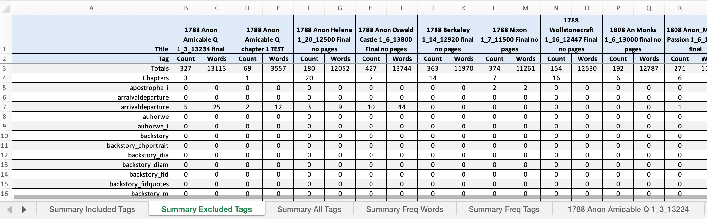
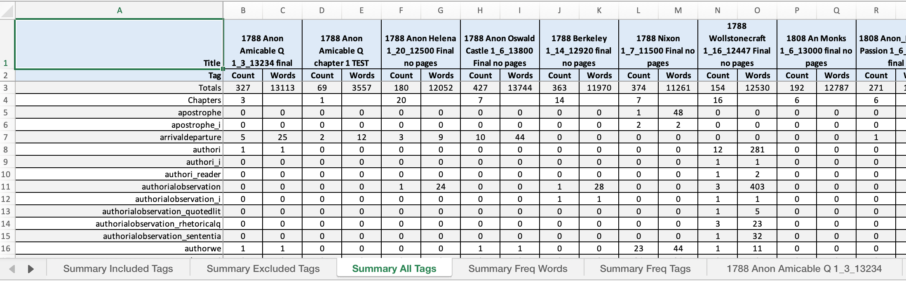
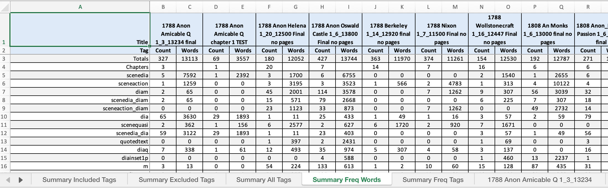
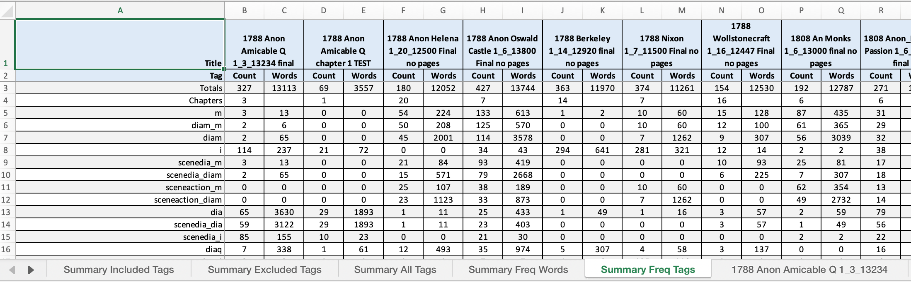
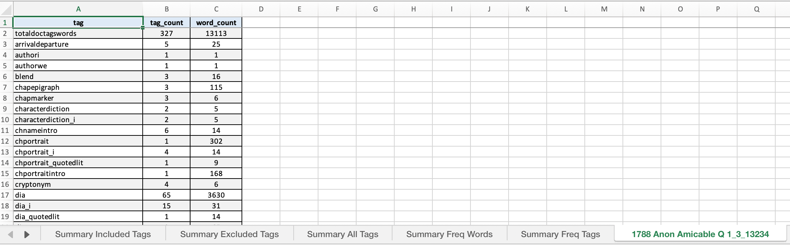

# Novel Scene Analysis Project

[](https://gitpod.io/#https://github.com/aculich/novel-scenification)

This repository contains tools for analyzing scenes and tags in literary texts, particularly focusing on the evolution of scenic techniques in English novels from 1788-1828.

This repository supports the following paper, currently in preprint form being prepared for publication:

> # Scenification of the Novel in the Time of Jane Austen
>
> Authors: Nicholas Paige^1,*; Aaron Culich^2
>
> - ^1 University of California, Department of French, Berkeley CA 94530-2580 USA  
> - ^2 University of California, Eviction Research Network, Berkeley CA 94530 USA
>
> ## Abstract
>
> This paper presents a study of the evolving use of scenes in the English novel circa 1800. The distinction between summary and scene has been a basic one in classical narratology, but comparatively little research exists on the historical development of scenic narrative techniques. Although quantitative methods have identified growth in textual features that may be expected to be linked to changes in scenic narration, the typical bag-of-words approach has limited understanding of how techniques perceptible to human readers may change over time. Our approach uses a hierarchical tagging schema to annotate scene types and their internal components to assist in quantifying scenic architecture. The project described uses BeautifulSoup4 and custom Python scripts and future analysis will integrate computational tools such as BookNLP with custom scene annotations in order to understand the evolution of narrative techniques.
>
> ## Keywords
>
> Narratology, novel, fiction, scene, summary

## Tag Schema

The hierarchical tagging schema is comprised of primary scene category tags and nested component tags. Then we process the tagged text using BeautifulSoup4 and custom Python scripts (`count_tags.py` available in our github repository) to quantify:
   - Frequency and word count of each scene type
   - Hierarchical relationships between primary and component tags

The HTML files are tagged with a custom schema that identifies different scene types:

### Primary Scene Tags
- `<SceneDia>`: Dialogue-dominant scenes where character speech drives narrative progression
- `<SceneAction>`: Action-focused scenes depicting physical events or movements
- `<SceneQuasi>`: Transitional scenes blending scenic and summary elements
- `<ScenePerception>`: Scenes focused on character perception and sensory experience

### Component Tags
Within each scene type, we track:
- `<Dia>, <DiaM>, <DiaQ>`: Direct dialogue with varying attributions
- `<Trigger>`: Temporal or spatial anchors that signal scene transitions
- `<M>`: Markers denoting speech attribution or narrative framing
- `<FID>`: Free indirect discourse elements

## Data & Code Overview

The project analyzes manually tagged HTML files to track the development of scenic techniques in novels. It processes these files to count tags, calculate word counts within different scene types, and analyze hierarchical relationships between tags.

### Contents

- `count_tags.py`: The main script for processing tagged HTML files
- `data/input/`: Directory containing HTML files with manual tagging
- `data/counts/`: Directory where CSV output files are stored
- [`data/tag_counts_summary.xlsx`](https://github.com/aculich/novel-scenification/raw/refs/heads/main/data/tag_counts_summary.xlsx): Excel summary file of all tag counts and analysis (direct download link)

### Excel Summary Format

The `tag_counts_summary.xlsx` file contains a comprehensive analysis of tags used across your HTML corpus. We've organized it with four summary tabs:

#### 1. Summary Tabs
All of the Summary tabs provide this basic overview in each:
- **Sheet column**: Links to individual sheets for each document
- **Total_Tags**: Total number of tags in the document
- **Total_Words**: Total word count for the entire document
- **Chapter_Count**: Number of chapter markers. The chapter word counts are intentionally left blank in all summary tabs. (see [Issue #5](https://github.com/aculich/novel-scenification/issues/5))
- **Selected tag metrics**: Pre-selected important tags (SceneAction, SceneDia, Dialogue) with both count and word columns

#### 1a. Summary Included Tags Tab
This tab displays only the tags that are included in the [included_tags.tsv](./included_tags.tsv) file:

- Shows counts and word counts for each included tag across all documents
- Useful for focusing on a specific subset of tags that are most relevant to your analysis
- For chapters, the count column shows the number of chapter markers, while the words column is intentionally left blank

This tab answers: "How do my specifically selected tags distribute across documents?"


#### 1b. Summary Excluded Tags Tab
This tab displays only the tags that are excluded (listed in [excluded_tags.tsv](./excluded_tags.tsv)):
- Follows the same format as the Summary tab but limited to tags not in the included tags list
- Shows counts and word counts for excluded tags across all documents
- Useful for reviewing tags that might be less relevant or for quality control
- Like in other tabs, chapter word count cells are intentionally left blank

This tab answers: "What tags am I currently not focusing on in my analysis?"



#### 2. Summary All Tags Tab
This tab shows all tags in alphabetical order:
- Provides a consistent reference layout regardless of frequency
- Each column pair shows Count and Words for each tag
- Chapter word count cells are intentionally left blank

This tab answers: "What are all the tags used and their metrics?"



#### 3. Summary Freq Words Tab
This tab shows all tags sorted by their total word count across the corpus:
- Tags that contain the most words appear leftmost
- Secondary sorting is by tag count when word counts are equal
- Each column pair shows Count and Words for each tag
- Chapter word count cells are intentionally left blank

This tab answers: "Which tags contain the most textual content?"



#### 4. Summary Freq Tags Tab
This tab arranges tags by their frequency (count) across the corpus:
- The most frequently used tags appear leftmost
- Secondary sorting is by word count when tag counts are equal
- Each column pair shows Count and Words for each tag
- Chapter word count cells are intentionally left blank

This tab answers: "Which tags are used most frequently?"



#### Individual Document Sheets
Following the summary tabs, each document has its own sheet showing:
- Individual tag metrics including compound/nested tags
- Full breakdown of all tags used in that specific document
- Word counts for each tag and tag combination



### Requirements

Required Python packages:
```
beautifulsoup4>=4.9.3
pandas>=1.3.0
openpyxl>=3.0.7
```

### Usage

1. Install the required dependencies:
   ```
   pip install -r requirements.txt
   ```

2. Run the tag counting script:
   ```
   python count_tags.py
   ```

3. The script will:
   - Process all HTML files in `data/input/`
   - Generate CSV files with tag counts in `data/counts/`
   - Create a summary Excel file at `data/tag_counts_summary.xlsx`
   - Generate `included_tags.tsv` and `excluded_tags.tsv` based on tags in `tag_matches_detailed.tsv`

### Customizing Included/Excluded Tags

To modify which tags are included or excluded in the "Summary Included Tags" and "Summary Excluded Tags" tabs:

1. The script uses `tag_matches_detailed.tsv` to determine which tags to include. This file is generated using the `match_tags.py` script based on patterns in `keep_for_summary_tags.tsv`.

2. To customize the included tags:
   - Edit `keep_for_summary_tags.tsv` to add or remove tag patterns
   - Run `python match_tags.py` to generate an updated `tag_matches_detailed.tsv`
   - Run `python count_tags.py` to regenerate the Excel file with the new tag selection

3. You can also manually edit `tag_matches_detailed.tsv` to add or remove specific tags if you prefer direct control over the exact tags included.

## Tag Counts Summary

[View complete tag counts summary](https://github.com/aculich/novel-scenification/raw/refs/heads/main/data/tag_counts_summary.xlsx)

| Sheet | Total_Tags | Total_Words | Chapter_Count | SceneAction_Count | SceneAction_Words | SceneDia_Count | SceneDia_Words | Dialogue_Count | Dialogue_Words |
|-------|------------|-------------|---------------|------------------|------------------|----------------|----------------|----------------|----------------|
| [1788 Anon Amicable Q 1_3_13234 final](https://github.com/aculich/novel-scenification/blob/main/data/input/1788%20Anon%20Amicable%20Q%201_3_13234%20final.html) | 327 | 13113 | 3 | 1 | 1259 | 5 | 7592 | 65 | 3630 |
| [1788 Anon Amicable Q chapter 1 TEST](https://github.com/aculich/novel-scenification/blob/main/data/input/1788%20Anon%20Amicable%20Q%20chapter%201%20TEST.html) | 69 | 3557 | 1 | 0 | 0 | 1 | 2392 | 29 | 1893 |
| [1788 Anon Helena 1_20_12500 Final no pages](https://github.com/aculich/novel-scenification/blob/main/data/input/1788%20Anon%20Helena%201_20_12500%20Final%20no%20pages.html) | 180 | 12052 | 20 | 3 | 3195 | 3 | 1700 | 1 | 11 |
| [1788 Anon Oswald Castle 1_6_13800 Final no pages](https://github.com/aculich/novel-scenification/blob/main/data/input/1788%20Anon%20Oswald%20Castle%201_6_13800%20Final%20no%20pages.html) | 427 | 13744 | 7 | 3 | 3523 | 5 | 6153 | 25 | 433 |
| [1788 Berkeley 1_14_12920 final no pages](https://github.com/aculich/novel-scenification/blob/main/data/input/1788%20Berkeley%201_14_12920%20final%20no%20pages.html) | 363 | 11970 | 14 | 1 | 566 | 0 | 0 | 0 | 0 |
| [1788 Nixon 1_7_11500 Final no pages](https://github.com/aculich/novel-scenification/blob/main/data/input/1788%20Nixon%201_7_11500%20Final%20no%20pages.html) | 374 | 11261 | 7 | 2 | 4783 | 0 | 0 | 1 | 16 |
| [1788 Wollstonecraft 1_16_12447 Final no pages](https://github.com/aculich/novel-scenification/blob/main/data/input/1788%20Wollstonecraft%201_16_12447%20Final%20no%20pages.html) | 154 | 12530 | 16 | 1 | 313 | 2 | 1540 | 3 | 57 |
| [1808 An Monks 1_6_13000 final no pages](https://github.com/aculich/novel-scenification/blob/main/data/input/1808%20An%20Monks%201_6_13000%20final%20no%20pages.html) | 192 | 12787 | 6 | 4 | 10122 | 1 | 2655 | 2 | 59 |
| [1808 Anon_Master Passion 1_6_11555 final](https://github.com/aculich/novel-scenification/blob/main/data/input/1808%20Anon_Master%20Passion%201_6_11555%20final.html) | 260 | 11404 | 6 | 4 | 3185 | 6 | 3848 | 77 | 2421 |
| [1808 Anon_Master Passion Chapter 1-2 TEST](https://github.com/aculich/novel-scenification/blob/main/data/input/1808%20Anon_Master%20Passion%20Chapter%201-2%20TEST.html) | 76 | 3499 | 2 | 1 | 303 | 1 | 893 | 22 | 388 |
| [1808 Montague 1_2_12825 Final no pages](https://github.com/aculich/novel-scenification/blob/main/data/input/1808%20Montague%201_2_12825%20Final%20no%20pages.html) | 141 | 12566 | 2 | 2 | 2351 | 4 | 3404 | 3 | 126 |
| [1808 Norris 1_7_12512 final no pages](https://github.com/aculich/novel-scenification/blob/main/data/input/1808%20Norris%201_7_12512%20final%20no%20pages.html) | 329 | 12300 | 7 | 4 | 3869 | 6 | 3012 | 54 | 1126 |
| [1808 Thomas](https://github.com/aculich/novel-scenification/blob/main/data/input/1808%20Thomas.html) | 352 | 13185 | 4 | 2 | 2347 | 4 | 5871 | 21 | 617 |
| [1808 Thompson](https://github.com/aculich/novel-scenification/blob/main/data/input/1808%20Thompson.html) | 522 | 13089 | 5 | 6 | 2926 | 6 | 3615 | 10 | 47 |
| [1828 Bray Protestant 1_2_14300 Final no pages](https://github.com/aculich/novel-scenification/blob/main/data/input/1828%20Bray%20Protestant%201_2_14300%20Final%20no%20pages.html) | 434 | 13434 | 2 | 0 | 0 | 2 | 12020 | 1 | 95 |
| [1828 Colburn 1_2_13824 FINAL no page](https://github.com/aculich/novel-scenification/blob/main/data/input/1828%20Colburn%201_2_13824%20FINAL%20no%20page.html) | 219 | 13594 | 2 | 5 | 5721 | 3 | 1793 | 12 | 537 |
| [1828 Cunningham 1_2_12439 Final no pages](https://github.com/aculich/novel-scenification/blob/main/data/input/1828%20Cunningham%201_2_12439%20Final%20no%20pages.html) | 263 | 11984 | 2 | 1 | 5884 | 1 | 6015 | 2 | 172 |
| [1828 Derenz 1_9_14614 final no pages no footnotes](https://github.com/aculich/novel-scenification/blob/main/data/input/1828%20Derenz%201_9_14614%20final%20no%20pages%20no%20footnotes.html) | 438 | 14550 | 9 | 5 | 4277 | 6 | 6505 | 24 | 822 |
| [1828 Harding](https://github.com/aculich/novel-scenification/blob/main/data/input/1828%20Harding.html) | 618 | 12921 | 4 | 0 | 0 | 4 | 12913 | 321 | 7501 |
| [1828 Harvey 1_3_13500 final no pages](https://github.com/aculich/novel-scenification/blob/main/data/input/1828%20Harvey%201_3_13500%20final%20no%20pages.html) | 280 | 12876 | 3 | 2 | 4007 | 3 | 8135 | 10 | 489 |
| [1828 Loudon 1_4_11057 final](https://github.com/aculich/novel-scenification/blob/main/data/input/1828%20Loudon%201_4_11057%20final.html) | 305 | 14696 | 4 | 3 | 6191 | 3 | 3261 | 28 | 1187 |


## Scene Samples

[View complete samples analysis](data/SAMPLES.md)

# Scene Samples

This document contains particularly rich examples of scene markup from each text, showing complex interactions between different types of scenes and their components. For each scene, we show interesting excerpts including openings, transitions, rich dialog sections, and endings.

## [1808 Norris 1_7_12512 final no pages.html](https://github.com/aculich/novel-scenification/blob/main/data/input/1808%20Norris%201_7_12512%20final%20no%20pages.html)

### Complex Sceneaction (Lines 49-111)

**Location:** [Lines 49-111](https://github.com/aculich/novel-scenification/blob/main/data/input/1808%20Norris%201_7_12512%20final%20no%20pages.html#L49-L111)

**Complexity Metrics:**
- Unique tag types: 15
- Total nested tags: 65
- Word count: 2259
- Tag types present: arrivaldeparture, authori, blend, dia, diam, diaq, exclamation, fid, fidquotes, i, m, monologue, monologuethought, reader, rhetoricalq

**Interesting Excerpts:**

*Scene Opening:* [Lines 49-111](https://github.com/aculich/novel-scenification/blob/main/data/input/1808%20Norris%201_7_12512%20final%20no%20pages.html#L49-L111)
```html
<sceneaction><monologue>"To go again on the lake," <m>said he, as he stepped on a craggy eminence to contemplate the silvery light undulating on the serene expanse</m>
```

*Scene Ending:* [Lines 49-111](https://github.com/aculich/novel-scenification/blob/main/data/input/1808%20Norris%201_7_12512%20final%20no%20pages.html#L49-L111)
```html
<sceneaction><monologue>"To go again on the lake," <m>said he, as he stepped on a craggy eminence to contemplate the silvery light undulating on the serene expanse</m>, "to sit fool in the middle for the companionship of a woman of ton, a man of fashion, an antiquated soldier, and a thrifty dame! What sin have I committed that must be atoned for by such a mental flagellation!"</monologue>

While he spoke, he fortunately recollected he was now alone; and pronouncing a very devout address to the gracions Goddess of Liberty, he resolved to abandon himself to the felicity she for the present benignly granted him.

<rhetoricalq><reader>Reader</reader>, have you ever visited this charming country?</rhetoricalq> It is the birth place of <authori>my ancestors</authori> — this can only impress myself; <exclamation>but it is also the scene of a romance striking, eloquent, and seductive! Sir William had also found it dangerous!</exclamation> 'Twas true, his understanding was awake to the necessity of certain restrictions in moral society, and deemed the man a profligate who argued for their subversion: but to read a mere recital was neither to argue, to practise, or to justify its moral defects; and he read it repeatedly, and with new pleasure

<monologue>"It must be owned," <m>said he</m>, "there is something of St. Prieux in my composition. Those vivid sensations, those glowing delights, those unsubjugated fancies, are all features of myself. If I found an Eloisa who could bewitch my senses, I should make no scruple to abandon myself to her control. This would be to prosecute my rambles in the happiest state of perfection!"</monologue>

Musingly he walked forward. His imagination took the reins and drove him at headlong speed. He almost fancied himself in search of the object with whom, to realize the picture. His steps wandered by the lake, whose ripling waters, curling in the moon's beams, soothed his senses to tranquillity. A distant clock at length sounded on his ear, and he returned to seek the path from which he now discovered he had strayed.

To recover it was not however so easy. He missed his way through the windings of the rocks, and finding himself more deeply involved in the labyrinth of an unbeaten track, he endeavoured to descry a human habitation from which he could enquire his way. Even this was difficult; till happening to range round the foot of a barren hill, he accidentally discovered a dim light. On approaching he found it proceeded from a solitary hovel, and hastening towards it, he smartly knocked at the door.

<diam>"Fanchon," <m>said a voice of impatience within, and immediately the door was opened</m> —- "Fanchon, why did you stay so long?"</diam>

Sir William was struck with the tone and form of the speaker, and stood in silent surprise: but...
```

### Complex Scenedia (Lines 3-41)

**Location:** [Lines 3-41](https://github.com/aculich/novel-scenification/blob/main/data/input/1808%20Norris%201_7_12512%20final%20no%20pages.html#L3-L41)

**Complexity Metrics:**
- Unique tag types: 6
- Total nested tags: 32
- Word count: 669
- Tag types present: arrivaldeparture, dia, diam, i, m, reportedspeechquotes

**Interesting Excerpts:**

*Rich Dialog Section with Multiple Tag Types:* [Lines 321-340](https://github.com/aculich/novel-scenification/blob/main/data/input/1808%20Norris%201_7_12512%20final%20no%20pages.html#L321-L340)
```html
<dia>"Monsieur, yes: all of a sudden my lord became as quiet as I am now; and when the people who had followed him from the scuffle made a noise about the house, he was not a whit moved by it –- he said they were blockheads, and that he had only done what he ought to do: so as Monsieur Mellrose is not <i>tout a fait admirable</i>, we thought there might have been some old grudge between them. -— They best know that understand."</dia>
```

*Scene Opening:* [Lines 305-324](https://github.com/aculich/novel-scenification/blob/main/data/input/1808%20Norris%201_7_12512%20final%20no%20pages.html#L305-L324)
```html
<scenedia>He therefore turned from the path they had passed, and on reaching the hamlet, a light in the lower window of the mill proclaimed them admittance.

They gently knocked, and the door was opened by the miller himself. The terror of the poor man's countenance gave way to joy on seeing who had knocked; but instead of speaking he made a sign of silence, and beckoning them into a back room, guardedly shut the doors.

<diam>"Messieurs," <m>said he</m>
```

*Scene Ending:* [Lines 305-324](https://github.com/aculich/novel-scenification/blob/main/data/input/1808%20Norris%201_7_12512%20final%20no%20pages.html#L305-L324)
```html
<scenedia>He therefore turned from the path they had passed, and on reaching the hamlet, a light in the lower window of the mill proclaimed them admittance.

They gently knocked, and the door was opened by the miller himself. The terror of the poor man's countenance gave way to joy on seeing who had knocked; but instead of speaking he made a sign of silence, and beckoning them into a back room, guardedly shut the doors.

<diam>"Messieurs," <m>said he</m>, "cannot be surprised. I never was afraid in my life before, but a madman is not a common man."</diam>
<diam>"What! Ambrose!" <m>exclaimed the major</m>, "have you too been beaten?"</diam>
<dia>"No, Monsieur -— but we were obliged to avoid it by doing as we were ordered. —- My lord the Baron, as if he had been master of imposts, ordered Marguérite to prepare his apartment."</dia>
<diam>"There was no harm in that," observed the major.</diam>
<dia>"Excepting, Monsieur, that we wished to keep the apartment for our children to sleep in. Marguérite ventured to tell him so, but she might as well have gone to blows with the mill-wheel. He rolled his eyes. In fact the poor woman was frightened, and had only to do as he commanded."</dia>
<diam>"And did that appease him?" <m>asked Henry.</m></diam>
<dia>"Monsieur, yes: all of a sudden my lord became as quiet as I am now; and when the people who had followed him from the scuffle made a noise about the house, he was not a whit moved by it –- he said they were blockheads, and that he had only done what he ought to do: so as Monsieur Mellrose is not <i>tout a fait admirable</i>, we thought there might have been some old grudge between them. -— They best know that understand."</dia>

This sagacious observation was interrupted by a slight noise at the door which stunned the miller like a stroke of electricity; and it was slowly and widely opened by <arrivaldeparture>the subject of the preceding conversation</arrivaldeparture>. He stood for a moment contemplating the group as if he had never seen them before, and then with an air of contempt, composedly asked them <reportedspeechquotes>"What they wanted?"</reportedspeechquotes>
<diam>"Is this address to me, Baron?" <m>demanded the major, with some resentment</m>.</diam>
<dia>"Yes, to all spies who come to make secret enquiries."</dia>
<dia>"It was to spare you, Baron."</dia>
<diam>"I don't chose to be spared," he interrupted.</diam>

Henry had been observing him earnestly while he spoke -— <diam>"Certainly," <m>said he</m>, "I have seen you before."</diam>
<diam>"And I have seen you, sir," <m>he replied</m>, "what then?"</diam>
<diam>"Baron," <m>resumed the major, in a tone of pacification,</m> "I ...
```

## [1828 Harvey 1_3_13500 final no pages.html](https://github.com/aculich/novel-scenification/blob/main/data/input/1828%20Harvey%201_3_13500%20final%20no%20pages.html)

### Complex Sceneaction (Lines 3-54)

**Location:** [Lines 3-54](https://github.com/aculich/novel-scenification/blob/main/data/input/1828%20Harvey%201_3_13500%20final%20no%20pages.html#L3-L54)

**Complexity Metrics:**
- Unique tag types: 12
- Total nested tags: 56
- Word count: 2047
- Tag types present: arrivaldeparture, chapmarker, chnameintro, chportrait, dia, diam, diaother, diaq, i, m, quotedlit, quotesdoxa

**Interesting Excerpts:**

*Scene Opening:* [Lines 58-77](https://github.com/aculich/novel-scenification/blob/main/data/input/1828%20Harvey%201_3_13500%20final%20no%20pages.html#L58-L77)
```html
<sceneaction>Nugent's letter, and a much more brief one from his gay companion, being concluded, the two young men turned their entire attention to their patient and their prisoners. General Colville now occupied the bed in the only retiring-room which the house contained; the wounded and captive ruffians were laid upon straw, in an out-house, under a guard of peasants; and the rest of the party, that is to say, Prankendahi, Nugent, the valet, the landlord, his daughter, her husband, and the boatmen, assembled in the kitchen to await the arrival of the surgeon, and of the <i>amt-mann</i>
```

*Scene Ending:* [Lines 58-77](https://github.com/aculich/novel-scenification/blob/main/data/input/1828%20Harvey%201_3_13500%20final%20no%20pages.html#L58-L77)
```html
<sceneaction>Nugent's letter, and a much more brief one from his gay companion, being concluded, the two young men turned their entire attention to their patient and their prisoners. General Colville now occupied the bed in the only retiring-room which the house contained; the wounded and captive ruffians were laid upon straw, in an out-house, under a guard of peasants; and the rest of the party, that is to say, Prankendahi, Nugent, the valet, the landlord, his daughter, her husband, and the boatmen, assembled in the kitchen to await the arrival of the surgeon, and of the <i>amt-mann</i>, or rural magistrate, whose residence was about a mile distant, and to whom a peasant had been dispatched, to make a statement of the case.

Dorothea now displayed the combined fare of her larder, dairy, and cellar —- sausages, eggs, milk, and <quotedlit>"bread of the coarsest sort, and meager wine,"</quotedlit> all of which the travellers were quite hungry enough to enjoy. In the intervals of eating, much conversation was carried on concerning the incidents of the night; many conjectures were formed; and Frankendahl and Nugent, in answer to their questions, were told several anecdotes of Stoblitz's villany; he was a boatman of the neighbourhood, and all united in giving him a very bad character. Ludwig stated, that general Colville had been several times at his house, on his way to and from Baden, and other places in the vicinity, describing him as a gentleman of respectability and honour, said to be rich, and by all acknowledged to be generous.

<diam>"What family has general Colville?" <m>asked Nugent</m>.</diam>
<diam>"Only himself and his wife," <m>replied the landlord</m>.</diam>
<diam>"He has no wife — at least none here," <m>said Francis, the fisherman</m></diam>.

<diam>"Who was that handsome lady who was here with him one day then?" <m>questioned Ludwig.</m></diam>
<diam>"Dare say that was his daughter," <m>said Dorothea.</m></diam>
<diam>"No, she is his niece," <m>rejoined Francis.</m></diam>
<diam>"Dare say thou's wrong," <m>said his wife.</m></diam>
<diam>"No, I have heard her call the general uncle more than once, when I have been at St. Severine with fish," <m>returned Francis; and the assertion of course concluded this part of the colloquy.</m></diam>

Nugent was now impatiently expecting the arrival of the surgeon. -— <diam>"Is he a person of skill?" <m>he asked, but without a hope of having the question satisfactorily answered; for he supposed that those ignorant peasants had the same confidence in a wandering quack that savage tribes place in their conjurers.</m></diam>
<diam>"He is a right good doctor, sir, and does many wonderful cure...
```

### Complex Scenedia (Lines 128-202)

**Location:** [Lines 128-202](https://github.com/aculich/novel-scenification/blob/main/data/input/1828%20Harvey%201_3_13500%20final%20no%20pages.html#L128-L202)

**Complexity Metrics:**
- Unique tag types: 9
- Total nested tags: 82
- Word count: 2544
- Tag types present: arrivaldeparture, backstory, blend, dia, diam, diaother, diaq, exclamation, m

**Interesting Excerpts:**

*Scene Opening:* [Lines 210-213](https://github.com/aculich/novel-scenification/blob/main/data/input/1828%20Harvey%201_3_13500%20final%20no%20pages.html#L210-L213)
```html
<scenedia>The effect of doctor Sedgelake's opiate was not yet dissipated; the patient was still asleep; but Albert said he thought his rest would not last much longer.

Nugent dispatched him on his errand, and seating himself by general Colville's bedside, contemplated his striking countenance: he could not be less than seventy; his hair was silvered; and the lines of time and reflection were on his forehead; but it was there alone that age seemed to have set her seal; his frame was still robust, and his teeth entire; and on his right cheek was a deep scar, the honourable badge of a soldier.

Beverley thought he would soon awake, and <arrivaldeparture>when Dorothea came on tiptoe</arrivaldeparture>
```

*Scene Ending:* [Lines 210-229](https://github.com/aculich/novel-scenification/blob/main/data/input/1828%20Harvey%201_3_13500%20final%20no%20pages.html#L210-L229)
```html
<scenedia>The effect of doctor Sedgelake's opiate was not yet dissipated; the patient was still asleep; but Albert said he thought his rest would not last much longer.

Nugent dispatched him on his errand, and seating himself by general Colville's bedside, contemplated his striking countenance: he could not be less than seventy; his hair was silvered; and the lines of time and reflection were on his forehead; but it was there alone that age seemed to have set her seal; his frame was still robust, and his teeth entire; and on his right cheek was a deep scar, the honourable badge of a soldier.

Beverley thought he would soon awake, and <arrivaldeparture>when Dorothea came on tiptoe</arrivaldeparture> to announce that the coffee was ready, he requested her to bring it in, cherishing the hope that the general would find himself sufficiently refreshed to partake of it. She soon returned, and either the effect of the medicine was over, or the noise made in placing the table, dispersed it, for general Colville started, and opened his eyes. Nugent bent anxiously forwards, so that his youthful countenance was the first object the general beheld. He gazed on him earnestly, yet with visible wildness of manner, and exclaimed — <diaq>"My Maria!"</diaq>
<diam>"Dear heart, he calls on the Virgin," <m>said Dorothea.</m></diam>

Nugent suffered her to think so; but he knew, from the manner in which the words were spoken, that they were not intended for a Catholic invocation. Some one had said, the preceding evening, that general Colville had a niece; and Beverley supposed that, in the first bewildered moment of returning recollection, he had mistaken him for her.

"<diam>How do you feel yourself, my dear sir?" <m>said Nugent, in English.</m></diam>

His voice seemed to dispel the illusion, and again starting, as if from a dream, Colville exclaimed — <diaq>"Where am I?"</diaq>
<diam>"Safe, and amongst friends, sir, who will pay you every attention," <m>replied Beverley.</m></diam>
<diam>"I remember it all," <m>he exclaimed</m>; "my villainous servant was about to murder me, when some one came to my rescue, and fired on the assassins: to you then, generous, noble young man, I owe my life;"</diam> and as he spoke he stretched out his hand, and fervently pressed that of Nugent, who modestly replied — <diaq>"No, indeed, my dear sir, I was only one, and not the most active, of your deliverers; it was a young German nobleman, with whom I travel, who so bravely fired on, and disabled your infamous valet; and the men in whose boat we happened to be...
```

...

[View all scene samples](data/SAMPLES.md)
